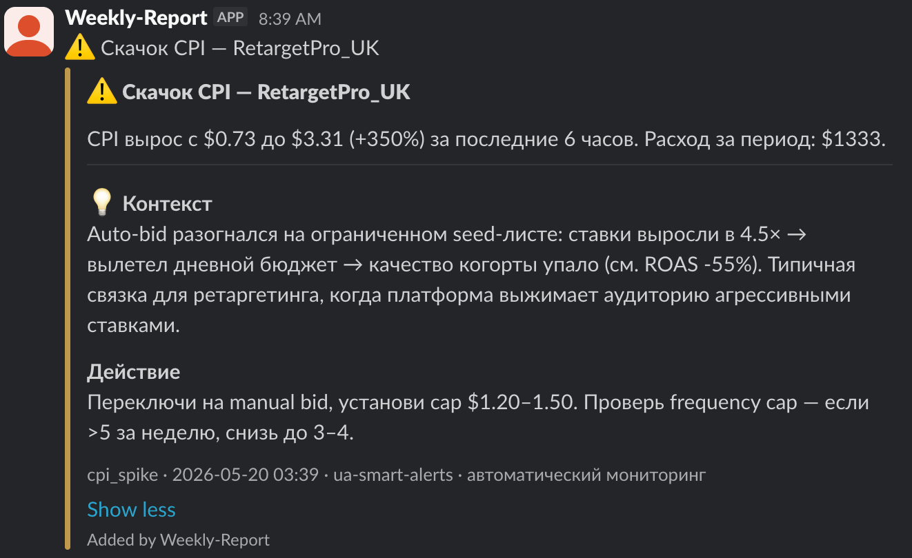
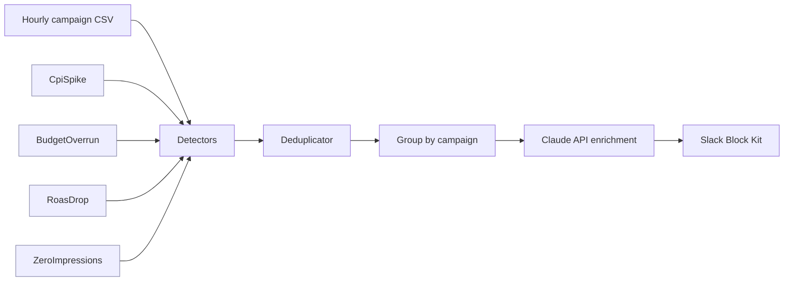

# ua-smart-alerts

> Production-grade UA campaign monitoring with AI-powered context. Detects anomalies in mobile ad campaigns, pings Slack with a clear narrative, and explains _why_ it likely happened — not just _what_ tripped the threshold.


## What you see

Real Slack output from the live system. Three alerts for the same campaign get **linked into a single narrative** — Claude sees them as one incident, not three independent problems:



Each alert ships with:
- **Severity color bar** (yellow = warning, red = critical) for instant scanability
- **💡 Контекст** — the most likely cause, in a UA-senior tone, no fluff
- **🎯 Действие** — one or two concrete next steps with realistic ranges (`снизь bid на 20–30%`, never fake-precise `на 23%`)

## How it works



1. **Detectors** check campaign data for known anomaly patterns. Each detector is a self-contained plugin.
2. **Deduplicator** suppresses repeated alerts so a stuck issue doesn't ping every cron tick.
3. **Group by campaign** — alerts for the same campaign in the same run are bundled into a single Claude call. This is what lets the AI write _connected_ narratives instead of three independent "could be auto-bid, could be attribution" guesses.
4. **Claude enrichment** turns raw threshold breaches into UA-senior-grade context and recommendations.
5. **Slack delivery** via Block Kit attachments with severity color bars.

## Detectors shipped

| Detector | Severity | What it catches |
|---|---|---|
| `CpiSpikeDetector` | warning | CPI rose >25% in last 6h vs prior 6h |
| `BudgetOverrunDetector` | critical | Daily spend exceeded budget by >20% |
| `RoasDropDetector` | warning | ROAS D1 dropped >40% vs 7-day baseline |
| `ZeroImpressionsDetector` | critical | Campaign had spend but zero impressions for 2+ hours |

Adding a new detector is a 4-line job: subclass `Detector` in `src/detectors/`, implement `check(df) -> list[Alert]`, register in `src/main.py`. No shared state, no framework magic.

## AI enrichment

The bot calls Claude (Sonnet 4.5) to add interpretation on top of raw detector output. Three design choices make this useful instead of noisy:

**Cross-alert context.** When the same campaign trips multiple detectors in one run, all alerts go to Claude in a single call. The model writes one coherent story — _"auto-bid spiraled, that's why CPI is up, budget vanished, and ROAS tanked"_ — instead of three disconnected guesses. Each alert in the response still ships independently to Slack, but each one references the others.

**Private system prompt.** The prompt that drives output quality lives in `prompts/system_prompt.ru.md` (gitignored). The repo only ships `prompts/system_prompt.example.md` — the minimal contract any forker needs to reproduce the format. The real prompt encodes ~5 iterations of negative examples ("ban generic 'high competition' filler"), hypothesis prioritization, and self-consistency rules ("if you advise pause, don't also advise raising the cap"). It's the actual product IP.

**Graceful degradation.** If `ANTHROPIC_API_KEY` is missing, the network is down, or the model returns malformed JSON — the alert still ships to Slack without the context block. No crash, no skipped alerts. Tested.

## Production deployment

The bot runs on **GitHub Actions cron** — every 6 hours, on a schedule aligned with the CPI detector's lookback window:

```yaml
  schedule:
    - cron: "0 */6 * * *"
  workflow_dispatch:
```

State persistence between runs uses `actions/cache` for `data/alert_state.json`, so dedup survives across runs without committing back to the repo. Secrets (`ANTHROPIC_API_KEY`, `SLACK_BOT_TOKEN`, `SLACK_CHANNEL_ID`, `SYSTEM_PROMPT_RU`) are stored as GitHub repository secrets and injected at runtime.

See [`.github/workflows/alerts.yml`](.github/workflows/alerts.yml) for the full pipeline.

## Setup (local)

```bash
# 1. Create virtual environment
python3.11 -m venv .venv
source .venv/bin/activate

# 2. Install dependencies
pip install -r requirements.txt

# 3. Configure environment
cp .env.example .env
# Edit .env — fill in SLACK_BOT_TOKEN, SLACK_CHANNEL_ID, ANTHROPIC_API_KEY

# 4. (Optional) Provide your own system prompt
# Without this, enrichment falls back to prompts/system_prompt.example.md
# and produces generic output. Copy and customize:
cp prompts/system_prompt.example.md prompts/system_prompt.ru.md

# 5. Run
python src/main.py

# 6. Run tests (23 tests, all mocked — no network calls)
pytest -v
```

## Project structure

```
src/
  detectors/
    base.py              # Alert dataclass + abstract Detector
    cpi_spike.py
    budget_overrun.py
    roas_drop.py
    zero_impressions.py
  data_loader.py         # CSV loading + timestamp handling
  deduplicator.py        # Suppress repeated alerts (JSON state file)
  claude_enrich.py       # Group-aware Claude API enrichment
  alert_builder.py       # Slack Block Kit attachments with severity colors
  slack_client.py        # Slack Web API client
  main.py                # Entry point
prompts/
  system_prompt.example.md   # Public contract (shipped)
  system_prompt.ru.md        # Private prompt (gitignored)
.github/workflows/
  alerts.yml             # GitHub Actions cron
data/
  sample_hourly_data.csv # Test data with planted anomalies
tests/
  test_detectors.py
  test_deduplicator.py
  test_claude_enrich.py  # Fully mocked, no network
docs/
  slack-screenshot.png
```

## Tech stack

Python 3.11 · pandas · Anthropic SDK (Claude Sonnet 4.5) · Slack Web API · GitHub Actions · pytest

## Author

**Ilya Sirotin** — UA / mobile performance marketing, building AI-augmented internal tools.

- LinkedIn: [ilya-sirotin](https://www.linkedin.com/in/ilya-sirotin-210b9a110/)
- Email: [ilushka.sirotin@gmail.com](mailto:ilushka.sirotin@gmail.com)

## License

MIT
